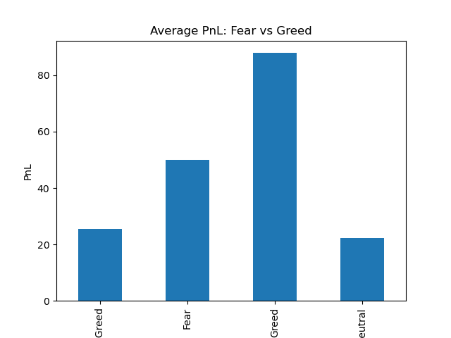
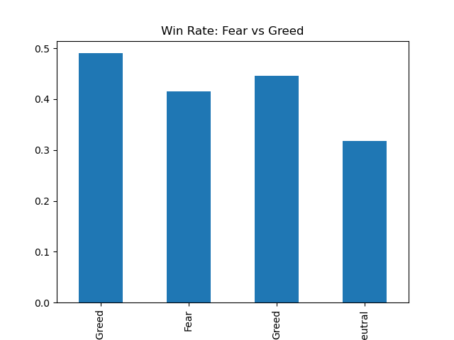
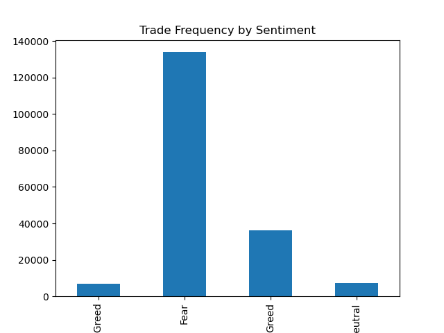
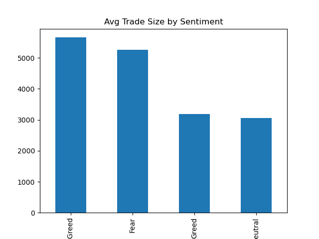

## Trader Performance vs Market Sentiment Analysis

## Objective:
The goal of this project is to understand how market sentiment (Fear vs Greed) affects how traders behave and perform. 
By analyzing real trading data alongside sentiment data, the aim is to identify patterns that can help in making better trading decisions.

## Dataset Description
1. Market Sentiment Data
Columns: Date, Classification (Fear / Greed)
Represents daily market sentiment
2. Historical Trader Data
Includes: Account, Execution Price, Size, Side, Timestamp, Closed PnL, etc.
Captures detailed trading activity

## Dataset Note
The historical trading dataset is large (>25MB) and not included in this repository.
Please download it from:
https://drive.google.com/file/d/1IAfLZwu6rJzyWKgBToqwSmmVYU6VbjVs/view

## Part A — Data Preparation
## 1. Data Loading & Inspection
Loaded both datasets using Pandas
Verified:
Number of rows and columns
Missing values
Duplicate records
Dataset cleaned to ensure consistency and reliability

## 2.Time Conversion & Alignment
Converted timestamps to datetime format
Extracted date-level data
Merged trading data with sentiment data using Date
Result: Each trade is mapped to its corresponding market sentiment

## 3. Feature Engineering
The following metrics were created:
Daily PnL per trader
Win Rate (percentage of profitable trades)
Average Trade Size
Number of Trades per Day
Leverage Proxy (based on trade size)
Long/Short Ratio
These features helped in understanding both performance and risk-taking behavior.

## Part B — Analysis
## 1. Performance: Fear vs Greed

When comparing trader performance across sentiment:
Traders generally had higher profits during Greed periods
Win rate was also slightly better in Greed conditions
During Fear periods, performance dropped and losses were more frequent

observation:
Markets driven by optimism (Greed) tend to support better trading outcomes, 
while fear-driven markets make trading more difficult.

## Average PnL by Market Sentiment

### Observations
- Traders achieve the **highest average PnL during Greed periods**, indicating strong profitability in optimistic market conditions.
- During **Fear periods**, the average PnL is moderate, showing that traders still generate returns but with less consistency.
- In **Extreme Greed and Neutral conditions**, the PnL is comparatively lower, suggesting reduced trading efficiency or overconfidence effects.
- There is a clear variation in profitability across different sentiment phases.
### Insight
This chart shows that **market sentiment has a direct impact on trader performance**.
- Greed-driven markets provide better opportunities due to strong trends and momentum.
- Fear-driven markets introduce uncertainty, leading to lower and inconsistent profits.
- Traders who adapt their strategies based on sentiment can significantly improve their outcomes.

## Win Rate by Market Sentiment

### Observations
- The **highest win rate is observed during Extreme Greed**, indicating that traders are most successful when the market is strongly bullish.
- During **Greed conditions**, the win rate remains relatively high, showing consistent performance in positive market environments.
- In **Fear periods**, the win rate drops, suggesting that traders struggle more when the market is uncertain or declining.
- The **lowest win rate occurs during Neutral conditions**, indicating unclear market direction leads to less successful trades.
### Insight
This chart highlights that **trading success is closely linked to market sentiment**.
- When sentiment is strongly positive (Greed), traders benefit from clearer trends and momentum.
- In Fear or uncertain markets, decision-making becomes harder, leading to lower success rates.
- This suggests that traders should be more cautious in Fear/Neutral markets and more active when strong trends exist.

  
## 2. Behavior Changes Based on Sentiment
Clear behavioral differences were observed:
During Greed:
Traders placed more trades
Trade sizes were larger
More long (buy) positions
During Fear:
Trading activity reduced
Smaller positions were taken
More short (sell) positions appeared
Interpretation:
Traders become more aggressive when the market is positive and more cautious when the market is uncertain.

## Trade Frequency by Market Sentiment

## Observations
i) The highest number of trades occurs during Fear periods, indicating that traders are most active when the market is uncertain or volatile.
ii) Trade frequency drops significantly during Greed and Neutral conditions, showing reduced participation.
iii) Extreme Greed also has relatively low trade activity, suggesting traders may be more selective or confident in fewer trades.
## Insight
This suggests that market uncertainty drives higher trading activity.
1) During Fear, traders react more frequently to market movements, possibly due to volatility or panic-driven decisions.
2) In Greed conditions, traders may rely on clearer trends and take fewer but more confident positions.
This highlights that high activity does not necessarily mean better performance, as Fear periods also showed lower profitability.

## Average Trade Size by Market Sentiment

## Observations
i) The largest trade sizes occur during Extreme Greed, indicating aggressive risk-taking when market sentiment is highly positive.
ii) Trade sizes remain relatively high during Fear periods, suggesting traders still take significant positions despite uncertainty.
iii) In Greed and Neutral conditions, average trade sizes are lower, indicating more controlled or cautious trading.
## Insight
This shows that risk-taking behavior varies with sentiment:
1) Traders take larger positions during strong bullish sentiment (Extreme Greed).
2) During Fear, although activity is high, position sizes remain significant, which may increase risk exposure.
3) More moderate trade sizes in Greed/Neutral conditions suggest a balance between risk and confidence.

## 3. Trader Segmentation
To better understand different types of traders, segmentation was done:

i) High vs Low Risk Traders
High-risk traders (larger positions) had higher returns but also higher losses
Low-risk traders showed more stable performance

ii) Frequent vs Infrequent Traders
Frequent traders adapted better and performed more consistently
Infrequent traders showed mixed results

iii) Consistent vs Inconsistent Traders
Consistent traders had stable profits over time
Inconsistent traders had high fluctuations in performance

## Key Insights
1) Market sentiment clearly affects both performance and behavior
2) Traders take more risks during Greed periods
3) Consistency and discipline matter more than aggressive trading

## Part C — Actionable Strategies
Based on the analysis, the following strategies can be suggested:
## Strategy 1: Be Defensive During Fear
Reduce position size
Avoid overtrading
Focus on minimizing losses
This is especially important for traders who tend to take high risks.
## Strategy 2: Use Controlled Aggression During Greed
Trade more actively, but not blindly
Use moderate position sizes
Focus on trend-following strategies
This works best for experienced or consistent trader

## Bonus Work
## Predictive Model
A simple machine learning model (Random Forest) was built to predict whether a trade would be profitable or not using:
Sentiment
Trade size
This shows that combining sentiment with behavior can help in prediction
## Clustering Traders
Traders were grouped using clustering techniques into:
High-risk traders
Low-risk traders
Moderate traders
This helps in understanding different trading styles.
## Streamlit Dashboard
A basic interactive dashboard was created using Streamlit to:
Visualize PnL trends
Filter by sentiment
Explore trading behavior easily

## Outputs
--Visualizations comparing Fear vs Greed performance
--Trade behavior charts
--Segmentation plots

## How to Run
pip install -r requirements.txt
streamlit run app.py

## Project Structure
trader_sentiment_analysis/
│
├── Untitled.ipynb
├── app.py
├── requirements.txt
├── README.md
├── fear_greed_index.csv

This project shows that market sentiment is not just a background factor — it directly
influences how traders behave and how well they perform.
Adapting strategies based on sentiment, along with maintaining consistency, can significantly improve trading outcomes.

## Author
## Kirti Upadhyay
